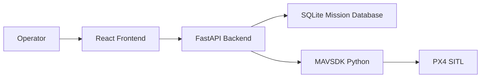

# Architecture

Vimantra AI Mission Planner Version 1.0 is a local, simulation-oriented ground-control application. It separates user interaction, API orchestration, mission persistence, MAVSDK integration, and workflow verification into distinct modules.

## System Context

## Components

### Frontend

The frontend is a React and TypeScript application built with Vite. It owns presentation, user interaction, map visualization, waypoint editing, mission save/load actions, drone controls, and telemetry display.

Primary frontend responsibilities:

- Render mission planning UI.
- Maintain local editing state.
- Call backend APIs through typed service modules.
- Poll telemetry snapshots.
- Keep operator-facing controls aligned with backend state.

### Backend

The backend is a FastAPI application. It exposes the application API, validates request/response models, coordinates mission persistence, and wraps MAVSDK drone operations.

Primary backend responsibilities:

- Health reporting.
- Mission CRUD.
- Mission upload to MAVSDK.
- Mission analytics and flight estimation.
- Drone connection lifecycle.
- Drone arm, disarm, and mission start actions.
- Telemetry snapshot collection.

Mission analytics live in `backend/analytics/` and remain independent from validation, pre-flight checks, and future AI modules. The analytics service computes deterministic estimates and warnings from saved mission geometry and waypoint metadata.

### Database

SQLite stores local missions and waypoints. Version 1.0 uses SQLite because it keeps local simulation workflows simple while preserving a real relational model.

### Simulation

The `simulation/` folder contains workflow verification scripts. These scripts exercise the same API paths used by the frontend and provide repeatable evidence for backend-only and PX4 SITL validation.

## Runtime Flow

1. Operator starts backend and frontend.
2. Frontend requests saved missions and drone status.
3. Operator edits waypoints on the map and waypoint panel.
4. Frontend sends mission save/load/upload requests to FastAPI.
5. Backend persists missions in SQLite.
6. Backend connects to PX4 SITL through MAVSDK when requested.
7. Backend sends upload and action commands through MAVSDK.
8. Frontend polls telemetry snapshots from the backend.

## Safety Boundary

Version 1.0 is designed for local simulation and PX4 SITL. It does not include autonomous AI planning, production flight authorization, physical aircraft safety checks, or fleet operations.

## Key Architecture Decisions

See [docs/10_ADR/](docs/10_ADR/) for recorded decisions:

- ADR-001: FastAPI
- ADR-002: React
- ADR-003: SQLite
- ADR-004: MAVSDK
- ADR-005: PX4
